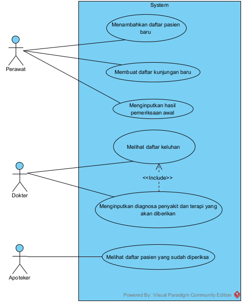

# Kelompok 2 Responsi 3 MPPL

### Anggota Kelompok
- Adri Aulia Mahran(G64190050) - Project Manager
- Falih Alwana Yasril(G64190067) - Frontend Developer
- Jevon Sanoturia(G64190056) - UI/UX Designer
- Muhammad Arief(G64190063) - Backend Developer

## Latar belakang

Pencatatan status dan rekam medis pasien pada klinik yang saat ini masih dilakukan secara konvensional dengan menggunakan kertas, dimana proses yang dilakukan masih melibatkan langsung aktivitas secara fisik. Saat pasien sudah mendaftar dan akan melakukan konsul status pasien harus diberikan ke dokter terlebih dahulu, kemudian dokter dapat mencatatkan diagnosa dan terapi yang diberikan pada status tersebut. Kemudian status tersebut akan diberikan ke apotik atau bagian obat untuk disiapkan obat yang akan diberikan kepada pasien.

## Tujuan

Pengembangan sistem ini bertujuan untuk bisa menyederhanakan proses bisnis yang terjadi pada sebuah klinik, dimana alur data yang berpindah secara manual diharapkan akan lebih efisien dan efektif ketika terintegrasi pada sebuah sistem. 

## User story

Sebagai seorang administrator :
- Saya ingin merekam data pasien untuk memudahkan pihak dokter dan pasien di pertemuan berikutnya
- Saya ingin mampu mengirim data pasien ke dokter untuk mempertajam diagnosa pasien.

Sebagai seorang dokter ; 
- Saya ingin memiliki rekam pasien untuk memudahkan tracking pasien.
- Saya ingin memasukkan hasil diagnosa pasien ke sistem komputer untuk mempercepat pertukaran data dengan pihak lain

## Cakupan

Sistem akan mempersingkat alur pelayanan pasien dengan menjembatani antara antrian awal, antrian dokter, antrian apoteker dan pembayaran. Pemasukan data menjadi lebih terintegrasi antar bagian-bagian pada rumah sakit sehingga pencatatan data lebih efektif dan kecacatan data dapat dibatasi.

Daftar dari fitur yang akan dikembangkan
- Melihat daftar pasien
- Menambahkan pasien baru
- Menambahkan kunjungan baru
- Melihat riwayat kunjungan
- Menyimpan riwayat kunjungan

Daftar dari fitur yang tidak akan dikembangkan
- Pasien tidak dapat melihat data yang berada pada aplikasi
- kebutuhan data pasien yang diperlukan dokter tidak berubah
- Fitur pembayaran
- Fitur untuk pasien

## Kebutuhan sistem (user, fitur utama, lingkungan pengembangan)

### User
- Dokter membutuhkan informasi yang terkait dengan pasien.
- Administrator perlu mengatur data yang masuk ke dalam sistem.

### Fitur Utama
- Menambahkan pasien baru
- Melihat daftar pasien
- Menambahkan kunjungan baru
- Melihat daftar kunjungan

### Lingkungan Pengembangan

#### Front End Development :
- Bootstrap
- CSS
- PHP
#### Back End Development :
- PHP
- MySQL

#### System Documentation:
- Trello
- Github
- Figma

## Risiko

- MVP tidak tercapai -> tinggi
- Bug tidak dapat ditangani oleh developer -> sedang
- Kemampuan developer tidak mencukupi -> tinggi

## Metodologi

Pengembangan perangkat lunak dengan metode waterfall akan diselesaikan secara sekuensial. Dimulai dari mendesain perangkat lunak yang akan dikembangkan lalu dilanjutkan dengan membangun atau mengimplementasikan desain, dan melakukan testing pada tahap akhir pengembangan. Alur pengembangan model waterfall mengikuti aliran air. Artinya, dalam proses pengembangan perangkat lunak, untuk masuk fase berikutnya, fase sebelumnya sudah ditesting, direview, dan diverifikasi secara menyeluruh.

## Use case

## Activity Diagram

## Class Diagram/ERD

## Link
[Link video demo](https://drive.google.com/drive/folders/1GAPuFOvn6Wjugytd8LABMmLq82QDjKDX?usp=share_link)  
[Link sheet test case (dah ada hasil testingnya)](https://anoobis-kapas.000webhostapp.com/php/daftarpasien.php) 
[Link deploy](https://docs.google.com/spreadsheets/d/1J7BkLg7A3XSX2DrU4G5BsvvZCjiKf8tUGV1sVV9iXRs/edit?usp=sharing) 
[Link figma](https://www.figma.com/file/WxLedMq24xgNE2lO3vurvg/Anoobies-team-library?node-id=0%3A1&t=7uqUWAgs82mRpDuV-1)
## Kendala
- Manajemen waktu yang masih belum optimal
- Kurangnya proaktifitas ketika menghadapi masalah
- Deploy terkendala sehingga memperlambat penyelesaian
- Komunikasi banyak tersendat
- Motivasi yang kurang memadai
